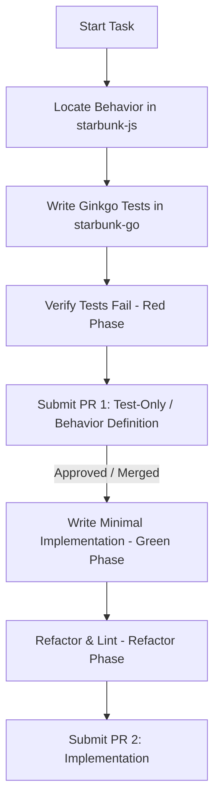

# Test-Driven Development (TDD) SDLC Workflow

To maintain code quality, ensure correct behavior replication from the legacy JS codebase, and prevent regression, `starbunk-go` implements a strict **Test-Driven Development (TDD)** Software Development Life Cycle (SDLC).

This workflow is **mandatory** for all developers and AI agents working on this project.

---

## Core Rule: The Two-PR Sequence

Every new feature, bot port, or behavioral adjustment must be completed in **two distinct pull requests**:



### 1. PR 1: Test-Only / Behavior Definition
- **Scope**: Must contain **only** test files (`*_test.go`) and the minimal necessary stubs, interfaces, or mock registrations to allow the code to compile.
- **Rule**: Absolutely no functional production implementation changes are allowed in this PR.
- **Goal**: To define the expected behavior through tests. The newly added tests must fail when run (or return default/stubbed outputs). This is the **Red** phase.

### 2. PR 2: Implementation
- **Scope**: Contains the actual production code that implements the feature or bot behavior.
- **Rule**: This PR must make the tests added in PR 1 pass without modifying the tests themselves (unless test bugs are found and corrected).
- **Goal**: To satisfy the test constraints with clean, minimal code. This is the **Green & Refactor** phase.

---

## Step-by-Step TDD Guide

### Step 1: Locate the Behavior in `starbunk-js`

Since `starbunk-go` is a Go-based port of `starbunk-js`, the desired behavior already exists in the sibling repository `/home/andrewgari/workspace/starbunk-js`.

Before writing any code:
1. Navigate to `/home/andrewgari/workspace/starbunk-js/src/<botname>/`.
2. Look at the existing tests under `tests/` (or the source file if tests don't exist).
3. Identify:
   - What triggers the bot (message patterns, roles, guild permissions).
   - What the bot replies or executes (message text, DM alerts, webhooks, voice channels).
   - Edge cases (caps/lowercase, punctuation, bot self-messages, command arguments).

### Step 2: Write the Ginkgo BDD Tests (Red Phase)

Write a Ginkgo test suite under `cmd/<botname>/` or the appropriate package in `internal/`.

1. **Bootstrap the Suite** (if not already present in the package):
   ```go
   package main_test

   import (
       "testing"
       . "github.com/onsi/ginkgo/v2"
       . "github.com/onsi/gomega"
   )

   func TestMyBot(t *testing.T) {
       RegisterFailHandler(Fail)
       RunSpecs(t, "MyBot Suite")
   }
   ```

2. **Define the Specs**:
   Draft BDD specs using `Describe`, `Context`, `It`, and `Expect` or `DescribeTable`. Keep tests clean and focused on input/output behaviors.
   ```go
   var _ = Describe("MyBot Reply Strategy", func() {
       var strategy ReplyStrategy

       Describe("ShouldTrigger", func() {
           It("triggers on specific pattern", func() {
               msg := &discordgo.MessageCreate{
                   Message: &discordgo.Message{Content: "trigger-phrase"},
               }
               Expect(strategy.ShouldTrigger(msg)).To(BeTrue())
           })
       })

       Describe("Response", func() {
           It("returns the expected response", func() {
               msg := &discordgo.MessageCreate{
                   Message: &discordgo.Message{Content: "trigger-phrase"},
               }
               Expect(strategy.Response(msg)).To(Equal("Expected Reply!"))
           })
       })
   })
   ```

3. **Verify the Failures**:
   Run the tests locally:
   ```bash
   go test ./cmd/<botname>/...
   ```
   Confirm that the new specs fail (are Red).

4. **Submit PR 1** containing the tests.

---

## Step 3: Implement and Refactor (Green & Refactor Phase)

Once PR 1 is merged/approved, implement the code to pass the tests.

1. Write the minimal Go code required to satisfy the failing test conditions.
2. Run tests locally:
   ```bash
   go test ./cmd/<botname>/...
   ```
   Ensure tests are green.
3. Refactor the code for simplicity, performance, and Go idiomatic standards.
4. Run static validation checks:
   ```bash
   go build ./...
   go vet ./...
   golangci-lint run
   bash scripts/devops-validate.sh
   ```
5. Submit PR 2 containing the implementation.

---

## Benefits of this SDLC
- **Clear Objectives**: By writing tests first, developers and AI agents are forced to completely understand the requirements before coding.
- **Strict Separation**: Separating tests from implementation prevents developers from writing "convenient" tests that only match their implementation bugs.
- **Accurate Ports**: Directly translating JS specs into Go Ginkgo specs ensures that none of the original bot behaviors are lost or altered during the porting process.
